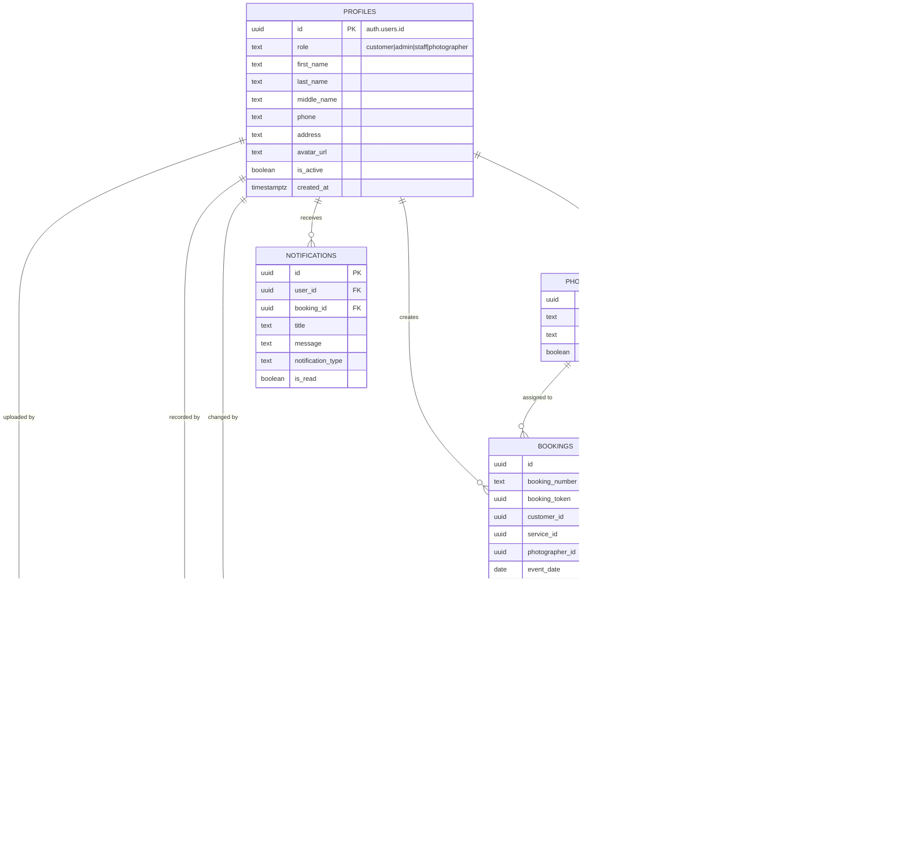

# E-Kodak Database ERD (Entity Relationship Diagram)

This is the Entity Relationship Diagram for Phase 3 of the E-Kodak Capstone Project. It represents the actual implemented schema in Supabase.

```mermaid
erDiagram
    PROFILES {
        uuid id PK "auth.users.id"
        text role "customer|admin|staff|photographer"
        text first_name
        text last_name
        text middle_name
        text phone
        text address
        text avatar_url
        boolean is_active
        timestamptz created_at
    }

    SERVICE_CATEGORIES {
        uuid id PK
        text name
        text description
        boolean is_active
    }

    SERVICES {
        uuid id PK
        uuid category_id FK
        text slug
        text name
        numeric base_price
        numeric down_payment_amount
        jsonb tiers
        boolean is_active
    }

    PHOTOGRAPHER_PROFILES {
        uuid id PK "profiles.id"
        text specialization
        text bio
        boolean is_available
    }

    PHOTOGRAPHER_AVAILABILITY {
        uuid id PK
        uuid photographer_id FK
        date availability_date
        time start_time
        time end_time
        text status
    }

    BOOKINGS {
        uuid id PK
        text booking_number
        uuid booking_token
        uuid customer_id FK
        uuid service_id FK
        uuid photographer_id FK
        date event_date
        text status
        numeric total_amount
        numeric down_payment_amount
        numeric remaining_balance
        text payment_status
    }

    BOOKING_STATUS_HISTORY {
        uuid id PK
        uuid booking_id FK
        text status
        uuid changed_by FK
        text remarks
        timestamptz created_at
    }

    PAYMENTS {
        uuid id PK
        uuid booking_id FK
        numeric amount
        text payment_type
        text payment_method
        uuid recorded_by FK
        timestamptz payment_date
    }

    NOTIFICATIONS {
        uuid id PK
        uuid user_id FK
        uuid booking_id FK
        text title
        text message
        text notification_type
        boolean is_read
    }

    SMS_LOGS {
        uuid id PK
        uuid booking_id FK
        uuid customer_id FK
        text phone_number
        text message
        text status
    }

    PHOTO_OUTPUTS {
        uuid id PK
        uuid booking_id FK
        text file_path
        text status
        uuid uploaded_by FK
    }

    %% Relationships
    PROFILES ||--o| PHOTOGRAPHER_PROFILES : "is a"
    PROFILES ||--o{ BOOKINGS : "creates"
    PROFILES ||--o{ NOTIFICATIONS : "receives"
    
    SERVICE_CATEGORIES ||--o{ SERVICES : "categorizes"
    
    SERVICES ||--o{ BOOKINGS : "selected for"
    
    PHOTOGRAPHER_PROFILES ||--o{ PHOTOGRAPHER_AVAILABILITY : "has"
    PHOTOGRAPHER_PROFILES ||--o{ BOOKINGS : "assigned to"
    
    BOOKINGS ||--o{ BOOKING_STATUS_HISTORY : "tracks"
    BOOKINGS ||--o{ PAYMENTS : "paid via"
    BOOKINGS ||--o{ SMS_LOGS : "triggers"
    BOOKINGS ||--o{ PHOTO_OUTPUTS : "contains"
    
    PROFILES ||--o{ BOOKING_STATUS_HISTORY : "changed by"
    PROFILES ||--o{ PAYMENTS : "recorded by"
    PROFILES ||--o{ PHOTO_OUTPUTS : "uploaded by"
```
