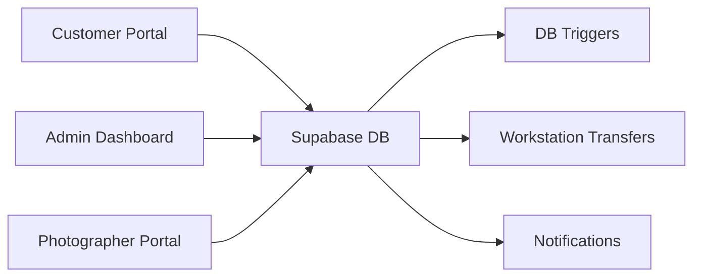
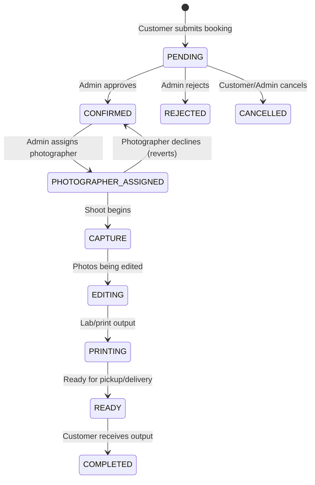

# E-Kodak Process Evaluation
## Customer → Admin → Photographer → Finance

---

## System Architecture Overview



| Portal | Route | Pages |
|--------|-------|-------|
| Customer | `/dashboard/*` | 11 pages (Home, Book, Bookings, Details, Progress, Payments, Gallery, Activity, Notifications, Profile, Settings) |
| Admin | `/admin/*` | 15 pages (Dashboard, Bookings, BookingDetail, Customers, Photographers, Payments, Photos, Notifications, SMS, Security, Services, Settings, Staff, CMS, Workstation) |
| Photographer | `/photographer/*` | 5 pages (Dashboard, Bookings, Availability, Uploads, Settings) |

---

## 1. Booking Status Lifecycle



### DB-Enforced Statuses (CHECK constraint)
`PENDING` → `CONFIRMED` → `PHOTOGRAPHER_ASSIGNED` → `CAPTURE` → `EDITING` → `PRINTING` → `READY` → `COMPLETED` | `REJECTED` | `CANCELLED`

---

## 2. Customer Booking Flow ✅

| Step | What Happens | Service Function | Status |
|------|-------------|-----------------|--------|
| 1. Select package | Customer picks service, tier, date/time, location | UI in [BookSessionPage.jsx](file:///c:/Users/emjun/Downloads/E-kodak%20Final/src/pages/dashboard/BookSessionPage.jsx) | ✅ Working |
| 2. Security validation | XSS/injection checks on all inputs | [`validateBookingSecurity()`](file:///c:/Users/emjun/Downloads/E-kodak%20Final/src/lib/securityValidator.js) | ✅ Working |
| 3. File upload | Reference images with MIME + size validation (10MB max) | [`validateUploadFile()`](file:///c:/Users/emjun/Downloads/E-kodak%20Final/src/lib/securityValidator.js) | ✅ Working |
| 4. Notes consolidation | Student/wedding/corporate details + add-ons serialized into `notes` column | [`createBooking()`](file:///c:/Users/emjun/Downloads/E-kodak%20Final/src/services/bookingService.js#L21) | ✅ Working |
| 5. Insert | Booking created with status `PENDING`, payment `UNPAID` | Supabase insert | ✅ Working |
| 6. QR code | Background QR generation for booking token | [`generateAndStoreQRCode()`](file:///c:/Users/emjun/Downloads/E-kodak%20Final/src/services/qrService.js) | ✅ Working |
| 7. View bookings | Customer can view list + detail | [MyBookingsPage](file:///c:/Users/emjun/Downloads/E-kodak%20Final/src/pages/dashboard/MyBookingsPage.jsx) → [BookingDetailsPage](file:///c:/Users/emjun/Downloads/E-kodak%20Final/src/pages/dashboard/BookingDetailsPage.jsx) | ✅ Working |

> [!TIP]
> The booking creation flow is well-architected with layered security, file validation, and structured notes parsing.

---

## 3. Admin Booking Management ✅

| Step | What Happens | Service Function | Status |
|------|-------------|-----------------|--------|
| 1. View queue | Paginated, filtered, searchable bookings list | [`getAdminBookings()`](file:///c:/Users/emjun/Downloads/E-kodak%20Final/src/services/bookingAdminService.js#L54) | ✅ Working |
| 2. Approve/Reject | Status → `CONFIRMED` or `REJECTED` | [`updateBookingStatus()`](file:///c:/Users/emjun/Downloads/E-kodak%20Final/src/services/bookingAdminService.js#L296) | ✅ Working |
| 3. QR on confirm | QR code generated when status = `CONFIRMED` | Auto-triggered in `updateBookingStatus` | ✅ Working |
| 4. Status history | Every status change logged with timestamp + who | `booking_status_history` table | ✅ Working |
| 5. Notifications | Customer notified on status changes | [`createNotification()`](file:///c:/Users/emjun/Downloads/E-kodak%20Final/src/services/bookingAdminService.js#L439) | ✅ Working |
| 6. Soft delete | Bookings can be soft-deleted with reason | `is_deleted`, `deleted_at`, `deletion_reason` columns | ✅ Working |

---

## 4. Photographer Assignment Flow ✅

| Step | What Happens | Service Function | Status |
|------|-------------|-----------------|--------|
| 1. Check availability | Fetches all photographers with workload + conflicts | [`getPhotographersWithWorkloadAndAvailability()`](file:///c:/Users/emjun/Downloads/E-kodak%20Final/src/services/bookingAdminService.js#L479) | ✅ Working |
| 2. Conflict detection | Same-date bookings, time overlaps, unavailable dates | Lines 538–569 in bookingAdminService.js | ✅ Working |
| 3. Assign | Admin assigns photographer → status = `PHOTOGRAPHER_ASSIGNED` | [`assignPhotographerToBooking()`](file:///c:/Users/emjun/Downloads/E-kodak%20Final/src/services/bookingAdminService.js#L606) | ✅ Working |
| 4. Notify both | Customer + Photographer both get notifications | `createNotification()` for both | ✅ Working |
| 5. Reassign | Change photographer on existing booking | [`reassignPhotographer()`](file:///c:/Users/emjun/Downloads/E-kodak%20Final/src/services/bookingAdminService.js#L682) | ✅ Working |
| 6. Unassign | Remove photographer, revert to `CONFIRMED` | [`unassignPhotographer()`](file:///c:/Users/emjun/Downloads/E-kodak%20Final/src/services/bookingAdminService.js#L758) | ✅ Working |

---

## 5. Photographer Portal Flow ✅

| Step | What Happens | Service Function | Status |
|------|-------------|-----------------|--------|
| 1. View assigned | Photographer sees their bookings with parsed briefs | [`getAssignedBookings()`](file:///c:/Users/emjun/Downloads/E-kodak%20Final/src/services/photographerService.js#L30) | ✅ Working |
| 2. Accept | Locks assignment → status = `CONFIRMED` + workstation log | [`acceptAssignment()`](file:///c:/Users/emjun/Downloads/E-kodak%20Final/src/services/photographerService.js#L174) | ✅ Working |
| 3. Decline | Unassigns + reverts to `PENDING` + urgent workstation alert | [`declineAssignment()`](file:///c:/Users/emjun/Downloads/E-kodak%20Final/src/services/photographerService.js#L233) | ✅ Working |
| 4. Advance status | Photographer progresses: CAPTURE → EDITING etc. | [`updateBookingStatusByPhotographer()`](file:///c:/Users/emjun/Downloads/E-kodak%20Final/src/services/photographerService.js#L129) | ✅ Working |
| 5. Reschedule request | Photographer requests date change → workstation escalation | [`requestRescheduleByPhotographer()`](file:///c:/Users/emjun/Downloads/E-kodak%20Final/src/services/photographerService.js#L294) | ✅ Working |
| 6. Upload outputs | Photos uploaded with validation (25MB max, images/PDF) | [`uploadPhotoOutput()`](file:///c:/Users/emjun/Downloads/E-kodak%20Final/src/services/photographerService.js#L614) | ✅ Working |
| 7. KPI stats | Real-time counts: today's shoots, upcoming, in-progress, completed | [`getPhotographerStats()`](file:///c:/Users/emjun/Downloads/E-kodak%20Final/src/services/photographerService.js#L346) | ✅ Working |
| 8. Availability | Set daily availability, toggle general availability | [`setAvailability()`](file:///c:/Users/emjun/Downloads/E-kodak%20Final/src/services/photographerService.js#L446), [`toggleGeneralAvailability()`](file:///c:/Users/emjun/Downloads/E-kodak%20Final/src/services/photographerService.js#L485) | ✅ Working |

---

## 6. Finance / Payment Flow ✅

| Step | What Happens | Service Function | Status |
|------|-------------|-----------------|--------|
| 1. Customer views billing | Smart price resolution: DB → tier → base_price → default ₱1,500 | [`getCustomerBillingData()`](file:///c:/Users/emjun/Downloads/E-kodak%20Final/src/services/customerPaymentService.js#L20) | ✅ Working |
| 2. Customer submits payment | GCash/Maya/Bank/Counter with reference number | [`submitPayment()`](file:///c:/Users/emjun/Downloads/E-kodak%20Final/src/services/customerPaymentService.js#L185) | ✅ Working |
| 3. Admin records payment | Manual payment entry by staff | [`recordPayment()`](file:///c:/Users/emjun/Downloads/E-kodak%20Final/src/services/bookingAdminService.js#L401) | ✅ Working |
| 4. DB trigger fires | `trg_update_booking_balance` auto-recalculates balances | PostgreSQL trigger function | ✅ Working |
| 5. Balance update | `remaining_balance`, `down_payment_amount`, `payment_status` all updated atomically | `update_booking_balance()` function | ✅ Working |
| 6. Auto-heal | If `total_amount` was 0, customer service proactively fixes it | Lines 113–123 in customerPaymentService.js | ✅ Working |

### Payment Status Resolution
```
UNPAID   → No payments recorded
PARTIAL  → Some payments, balance > 0
PAID     → Total paid ≥ total_amount
REFUNDED → Manual status (admin override only)
```

> [!NOTE]
> The `update_booking_balance()` trigger is robust — it sums ALL payments from the `payments` table and recalculates on every INSERT/UPDATE/DELETE.

---

## 7. Cross-Department Communication (Workstation Hub) ✅

| Transfer Type | Trigger | From → To | Priority |
|--------------|---------|-----------|----------|
| `ORDER_HANDOFF` | Photographer accepts assignment | Photographer → Admin | NORMAL |
| `ISSUE_ESCALATION` | Photographer declines assignment | Photographer → Admin | URGENT |
| `ISSUE_ESCALATION` | Photographer requests reschedule | Photographer → Admin | HIGH |
| `PAYMENT_VERIFICATION` | *(Available but not yet auto-triggered)* | Finance → Admin | — |
| `OUTPUT_SUBMISSION` | *(Available but not yet auto-triggered)* | Photographer → Admin | — |
| `DISPATCH_CLEARANCE` | *(Available but not yet auto-triggered)* | Admin → Customer | — |

---

## 8. Issues & Gaps Found

### 🔴 Critical

| # | Issue | Location | Impact |
|---|-------|----------|--------|
| 1 | **`NEXT_STATUS_MAP` skips `PRINTING`** | [bookingAdminService.js L29-35](file:///c:/Users/emjun/Downloads/E-kodak%20Final/src/services/bookingAdminService.js#L29-L35) | Admin cannot advance `EDITING → PRINTING`. Map goes `EDITING → READY`, but DB allows `PRINTING` and the UI references it everywhere. The status is orphaned — it can only be reached via photographer's `updateBookingStatusByPhotographer()`, not via admin "Advance Status" button. |

> [!CAUTION]
> The `NEXT_STATUS_MAP` must be updated to include: `EDITING → PRINTING` and `PRINTING → READY`. Currently the admin can only go `EDITING → READY`, completely bypassing the `PRINTING` step.

### 🟡 Medium

| # | Issue | Location | Impact |
|---|-------|----------|--------|
| 2 | **`acceptAssignment()` sets status back to `CONFIRMED`** | [photographerService.js L185](file:///c:/Users/emjun/Downloads/E-kodak%20Final/src/services/photographerService.js#L185) | When photographer accepts, status goes `PHOTOGRAPHER_ASSIGNED → CONFIRMED` instead of staying at `PHOTOGRAPHER_ASSIGNED`. This is a **regression** — the booking appears to "lose" its photographer assignment status in the lifecycle. Should remain `PHOTOGRAPHER_ASSIGNED` or advance forward. |
| 3 | **`booking_deliveries` table is unused** | DB table `booking_deliveries` | Full schema exists (delivery_type, tracking_number, carrier, dispatch_address, digital_access_expires_at) but zero frontend code reads/writes to it. Only referenced in a cascade delete. |
| 4 | **No automated output submission to workstation** | [photographerService.js](file:///c:/Users/emjun/Downloads/E-kodak%20Final/src/services/photographerService.js#L614) | When photographer uploads final photos via `uploadPhotoOutput()`, no `createTransferLog()` is called to notify admin. The `OUTPUT_SUBMISSION` transfer type exists but is never used. |
| 5 | **No payment-to-workstation bridge** | [customerPaymentService.js](file:///c:/Users/emjun/Downloads/E-kodak%20Final/src/services/customerPaymentService.js#L185) | When customer submits a payment, no workstation transfer is created for admin verification. The `PAYMENT_VERIFICATION` type exists but is unused. |

### 🟢 Low / Enhancement

| # | Issue | Location | Impact |
|---|-------|----------|--------|
| 6 | **`DISPATCH_CLEARANCE` is unused** | [workstationService.js](file:///c:/Users/emjun/Downloads/E-kodak%20Final/src/services/workstationService.js#L15) | Transfer type defined but never triggered. This should fire when admin marks booking `READY` to indicate outputs are ready for dispatch. |
| 7 | **Photographer can advance to any status** | [photographerService.js L129](file:///c:/Users/emjun/Downloads/E-kodak%20Final/src/services/photographerService.js#L129) | `updateBookingStatusByPhotographer()` accepts ANY status string — no validation that the transition is legal (e.g., photographer could theoretically set status to `COMPLETED`). |
| 8 | **`AdminWorkstation.jsx` is a stub** | [AdminWorkstation.jsx](file:///c:/Users/emjun/Downloads/E-kodak%20Final/src/pages/admin/AdminWorkstation.jsx) (1,217 bytes) | The admin workstation page is minimal — not rendering the full transfer inbox/queue. |

---

## 9. Recommended Fixes (Priority Order)

### Fix 1: Add `PRINTING` to `NEXT_STATUS_MAP`
```diff
 export const NEXT_STATUS_MAP = {
   CONFIRMED:             'PHOTOGRAPHER_ASSIGNED',
   PHOTOGRAPHER_ASSIGNED: 'CAPTURE',
   CAPTURE:               'EDITING',
-  EDITING:               'READY',
+  EDITING:               'PRINTING',
+  PRINTING:              'READY',
   READY:                 'COMPLETED',
 };
```

### Fix 2: `acceptAssignment()` should keep `PHOTOGRAPHER_ASSIGNED`
```diff
   const { data: updatedBooking, error: updateError } = await supabase
     .from('bookings')
     .update({
-      status: 'CONFIRMED',
+      status: 'PHOTOGRAPHER_ASSIGNED',
       updated_at: new Date().toISOString(),
     })
```

### Fix 3: Auto-trigger workstation on photo upload
Add `createTransferLog()` call inside `uploadPhotoOutput()` with `OUTPUT_SUBMISSION` type.

### Fix 4: Auto-trigger workstation on customer payment
Add `createTransferLog()` call inside `submitPayment()` with `PAYMENT_VERIFICATION` type.

---

## 10. Summary Scorecard

| Process | Status | Score |
|---------|--------|-------|
| Customer Booking Creation | ✅ Fully functional | 10/10 |
| Admin Approval/Rejection | ✅ Fully functional | 10/10 |
| Photographer Assignment | ✅ Fully functional | 9/10 |
| Photographer Accept/Decline | ⚠️ Accept status regression | 7/10 |
| Status Advancement | ⚠️ PRINTING skipped in admin map | 7/10 |
| Photo Output Upload | ✅ Functional, missing workstation notification | 8/10 |
| Payment Recording (Admin) | ✅ Fully functional with DB trigger | 10/10 |
| Payment Submission (Customer) | ✅ Functional, missing workstation notification | 8/10 |
| Workstation Hub | ⚠️ Partially wired — 3 of 6 transfer types unused | 5/10 |
| Delivery Tracking | ❌ Table exists, zero code | 0/10 |
| **Overall** | | **7.4/10** |

> [!IMPORTANT]
> The core happy path (Customer books → Admin approves → Photographer assigned → Shoot → Edit → Deliver → Pay) works end-to-end. The two critical fixes (#1 PRINTING gap and #2 accept status regression) should be addressed first. The workstation hub has strong architecture but needs the remaining transfer types wired up to reach its full potential.
